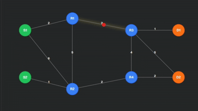

# Link-State Routing Visualizer 🚦

 

Interactive **Link-State Routing Algorithm** visualizer to understand how routers communicate and calculate shortest paths.

---

## 🎬 Preview

---

## 🔹 Features
- Add/remove **routers, sender nodes, and receiver nodes** dynamically.
- **Animated packet propagation** showing routing in real time.
- Neon-themed, interactive UI.
- Visualizes **shortest path calculations** dynamically.

---

## 📂 Project Structure
Link-State-Routing/
├── index.html # Main page
├── style.css # Styling and neon effects
├── script.js # Routing logic and animations
└── assets/ # Images, icons, demo GIF

---

## ⚡ How to Use
1. Open the [Live Demo](https://hrishikhapekar.github.io/Link-State-Routing/).
2. Adjust the number of nodes and routers using the UI controls.
3. Watch packets propagate and shortest paths get calculated in real time.

---

## 🛠️ Built With
- HTML5
- CSS3 (Neon-themed styling)
- JavaScript (Interactive animations and algorithm logic)

---

## 👤 Author
**Hrishi Khapekar** – [GitHub Profile](https://github.com/hrishikhapekar)

---
